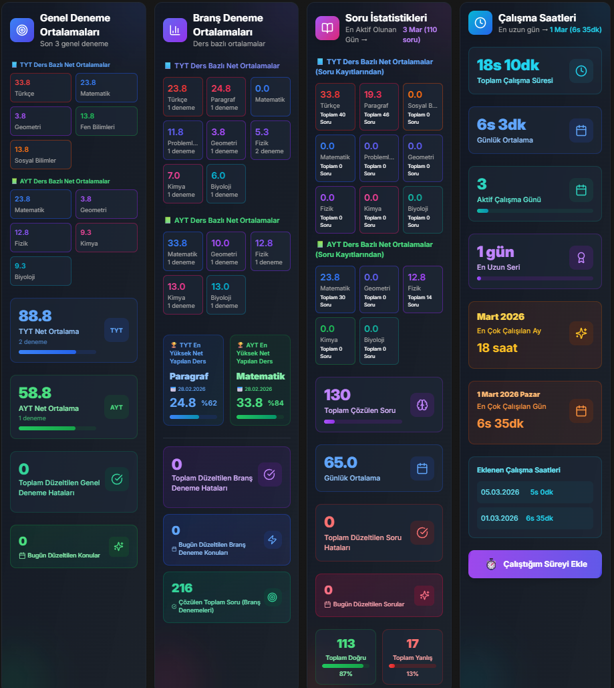
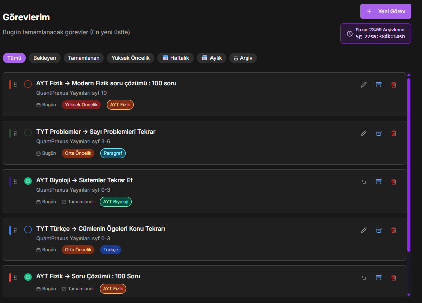
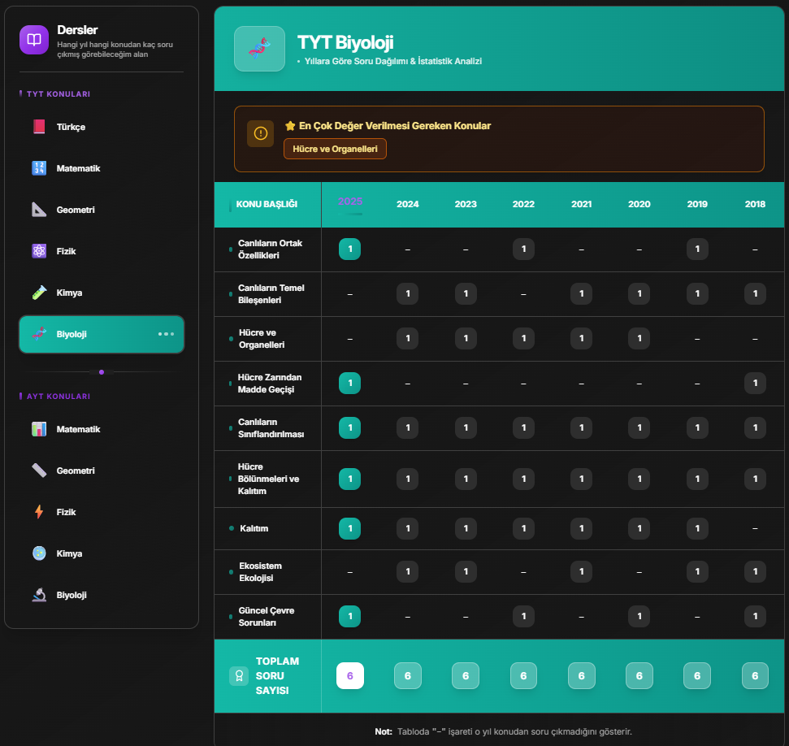
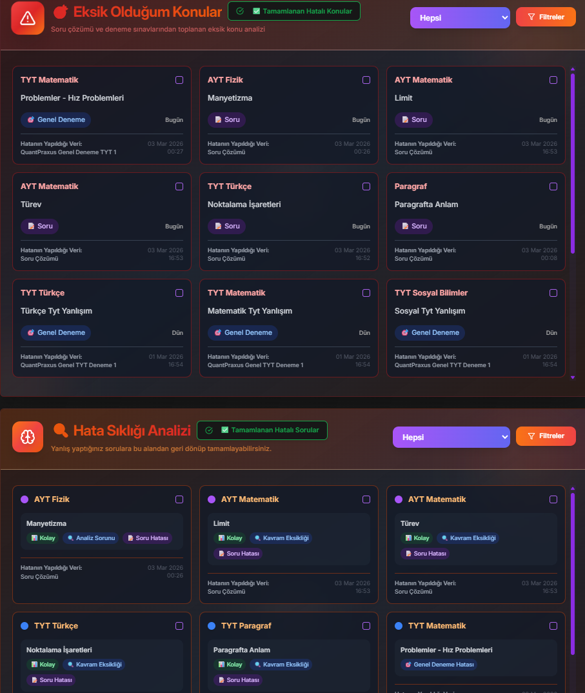

# 🚀 Quantpraxus  
### University Exam (YKS) Analysis and Performance Tracking System

## 📺 Demo Video

[](https://youtu.be/Rf20NjA9SwY)

*This video demonstrates the core features and usage scenarios of the project.*

> Report every study session down to the finest detail.

<div align="center">
  
</div>

> Plan your studies in detail.

<div align="center">
  
</div>

> Discover when and how many questions appeared for each subject, and organize your studies accordingly.

<div align="center">
  
</div>

> Review the mistakes you made in practice exams and question solving, and avoid repeating them.

<div align="center">
  
</div>


---

## 🎯 About

Quantpraxus is a full-stack analysis platform developed to make student performance measurable and analyzable during the university exam (YKS) preparation process. 

It has evolved from a simple score tracker into a modular system that analyzes performance trends, subject-based weaknesses, and study habits.

It runs smoothly on both web and desktop (Electron) environments.

---

## ✨ Core Features

- 📊 Performance dashboard with trend analysis
- 📚 Subject-based weakness detection (TYT / AYT)
- ⏱ Integrated Pomodoro timer & task management
- 🖥 Offline-first desktop support (Electron)
- 💾 JSON data export / import
- 📈 Detailed mock exam tracking & statistics
- 🌙 Dark / Light theme support

---

## 🛠 Tech Stack

| Layer      | Technology |
|------------|------------|
| Frontend   | React 18, TypeScript, Tailwind CSS, Radix UI |
| Backend    | Node.js, Express |
| Database   | PostgreSQL (Drizzle ORM - planned) + Local JSON Storage |
| Desktop    | Electron, Electron Builder |
| Testing    | Vitest, Playwright |

---

## 🏗 System Architecture

```
User (React + Vite)
        ↓
API Client (Fetch)
        ↓
Express Server (Node.js)
        ↓
Storage Layer (Drizzle ORM)
        ↓
JSON Storage ↔ PostgreSQL (Planned)
```

---

## ⚙️ Engineering Challenges

### 1. ESM vs CJS Conflict
The module system conflict between Vite (ESM) and Electron (CJS) was resolved by implementing a separate build pipeline strategy.

### 2. Timezone Normalization
Data inconsistencies arising from UTC and Turkey time zone differences were normalized using centralized date helper functions.

### 3. Performance Optimization
Performance was improved in datasets containing 1000+ records by using:
- Optimized queries
- Memoization techniques
- Lazy rendering

---

## 📁 Project Structure

```
.
├── client/        # React + Electron frontend
├── server/        # Express backend
├── electron/      # Electron main process
├── shared/        # Shared types & schemas
├── data/          # JSON storage
└── tests/         # Unit & E2E tests
```

---

## 🚀 Installation

### Requirements
- Node.js >= 20
- npm or yarn

### Setup

```bash
git clone https://github.com/beratcode03/quantpraxus.git
cd quantpraxus
npm install
```

### Development

```bash
# Web
npm run dev

# Desktop
npm run electron:dev
```

### Production Build

```bash
# Web
npm run build

# Electron
npm run electron:build
```

---

## 🧪 Testing

```bash
npm run test
npx playwright test
npm run test:coverage
```

---

## 🔮 Roadmap

- [ ] Full PostgreSQL migration
- [ ] Mobile app (React Native)
- [ ] AI-based study recommendations
- [ ] Cloud sync support
- [ ] Social comparison system

---

## 👨‍💻 Author

Built by **Berat Cankır**.

Quantpraxus represents an end-to-end full-stack system — from database modeling to cross-platform desktop packaging.

Contributions, issues, and discussions are welcome.

---

## 📄 License

MIT License — see `LICENSE` file for details.

---

⭐ If you find this project useful, consider giving it a star.